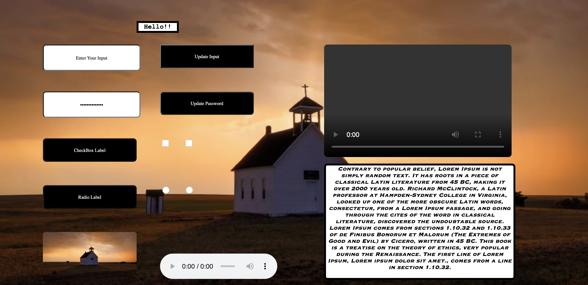

## python_html_generator

    HTML Page generator using Python ( For Quick Prototyping )

## Demo

## Completed

    - Button
    - Input
    - Label
    - Radio Button
    - Checkbox
    - Video 
    - Image
    - Audio

## Pending 
    
    - Scrollbar
    - File Object ( Local File Link + Thumbnail Image )
    - Url Object ( Remote Link + Thumbnail Image )

## Bugs

## Note

    This is a simple html page generator for quick prototyping and demo. Complex pages cannot be generated with this library. 

    Example: We can add html objects only in a linear manner, nesting objects is not possible with this library.

